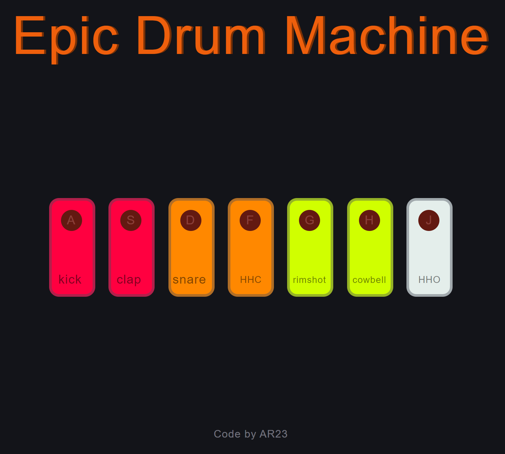

# Drum Machine - Vanilla JS

Javascript project for a drum machine that produces classic drum sounds

### Screenshot

## How to use

- Clone repository
- Open the `index.html` file in your browser
- Click on the pads to play the sounds
- If you are using a keyboard, press the keys `A`, `S`, `D`, `F`, `G`, `H`, `J` to play the sounds
